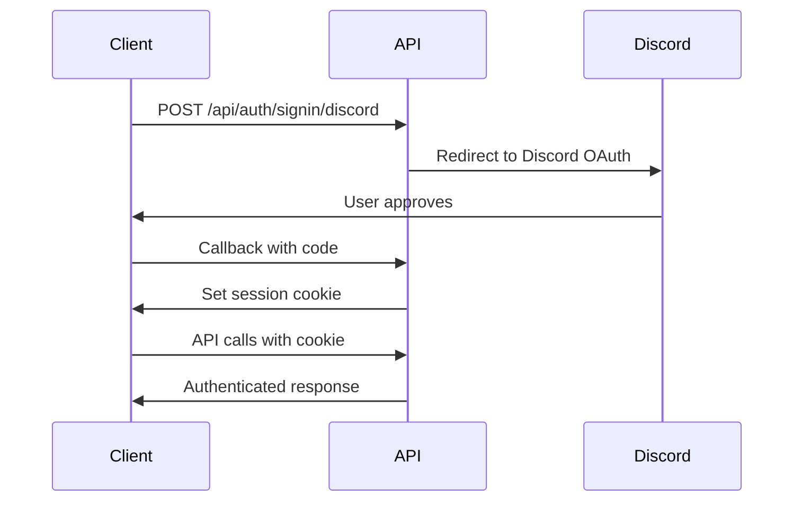

# AION2Builder API Documentation Guide

Complete guide to viewing, using, and integrating with the AION2Builder REST API.

## Table of Contents

1. [Overview](#overview)
2. [Viewing API Documentation](#viewing-api-documentation)
3. [Authentication](#authentication)
4. [Quick Start](#quick-start)
5. [API Usage Examples](#api-usage-examples)
6. [Generating Client SDKs](#generating-client-sdks)
7. [Testing the API](#testing-the-api)
8. [Best Practices](#best-practices)
9. [Troubleshooting](#troubleshooting)

---

## Overview

The AION2Builder API is a RESTful API built with Next.js that allows you to:

- Create and manage character builds
- Configure abilities, passives, and stigmas
- Manage daevanion rune configurations
- Like and share builds
- Retrieve game data (classes, skills, etc.)

### Base URL

- **Development**: `http://localhost:3000/api/v1`
- **Production**: `https://aion2builder.com/api/v1`

### API Specification

The complete OpenAPI 3.0 specification is available in `docs/openapi.yaml`.

---

## Viewing API Documentation

### Option 1: Swagger UI (Interactive)

Swagger UI provides an interactive interface to explore and test the API.

#### Installation

```bash
npm install --save-dev @redocly/cli
```

#### Using Swagger UI Online

1. Go to [Swagger Editor](https://editor.swagger.io/)
2. File → Import File → Select `docs/openapi.yaml`
3. Interact with the API directly in the browser

#### Using Redoc (Beautiful Documentation)

```bash
# Install Redoc CLI globally
npm install -g @redocly/cli

# Serve the OpenAPI spec
redocly serve-docs docs/openapi.yaml
```

Then visit `http://localhost:8080` for beautiful API documentation.

### Option 2: VS Code Extension

1. Install the [OpenAPI (Swagger) Editor](https://marketplace.visualstudio.com/items?itemName=42Crunch.vscode-openapi) extension
2. Open `docs/openapi.yaml` in VS Code
3. Get instant validation, syntax highlighting, and previews

### Option 3: Online Tools

- [Stoplight Studio](https://stoplight.io/studio/) - Visual API designer
- [Redocly](https://redocly.com/) - API documentation platform

---

## Authentication

### How Authentication Works

AION2Builder uses **NextAuth** for session-based authentication with Discord OAuth.

#### Authentication Flow



### Getting a Session Token

#### Method 1: Using the Web Interface (Recommended)

1. Visit `https://aion2builder.com`
2. Click "Sign In with Discord"
3. Complete OAuth flow
4. Open browser DevTools → Application → Cookies
5. Copy the `next-auth.session-token` value

#### Method 2: Programmatic Authentication

```bash
# Initiate Discord OAuth
curl -X POST https://aion2builder.com/api/auth/signin/discord

# Follow the redirect, approve on Discord
# You'll be redirected back with session cookie set
```

### Using the Session Token

#### With cURL

```bash
curl -X GET https://aion2builder.com/api/v1/builds/123 \
  -H "Cookie: next-auth.session-token=eyJhbGciOiJkaXQiLCJlbmMiOiJBMjU2R0NNIn0.."
```

#### With JavaScript (Fetch)

```javascript
const sessionToken = "your-session-token";

fetch("https://aion2builder.com/api/v1/builds/123", {
  headers: {
    Cookie: `next-auth.session-token=${sessionToken}`
  }
})
.then(response => response.json())
.then(data => console.log(data));
```

#### with JavaScript (Axios)

```javascript
import axios from "axios";

const sessionToken = "your-session-token";

axios.get("https://aion2builder.com/api/v1/builds/123", {
  headers: {
    Cookie: `next-auth.session-token=${sessionToken}`
  }
})
.then(response => console.log(response.data));
```

---

## Quick Start

### Prerequisites

- Node.js 18+
- npm or pnpm
- A Discord account (for authentication)

### Local Setup

```bash
# Clone the repository
git clone https://github.com/yourusername/aion2builder.git
cd aion2builder

# Install dependencies
pnpm install

# Set up environment variables
cp .env.example .env
# Edit .env with your database and Discord credentials

# Run database migrations
pnpm prisma migrate dev

# Start development server
pnpm dev
```

### First API Call

```bash
# List all builds (no authentication required)
curl http://localhost:3000/api/v1/builds?limit=10

# Response:
{
  "success": true,
  "data": [...],
  "count": 42
}
```

---

## API Usage Examples

### Example 1: Create a New Build

```bash
curl -X POST http://localhost:3000/api/v1/builds \
  -H "Content-Type: application/json" \
  -H "Cookie: next-auth.session-token=YOUR_TOKEN" \
  -d '{
    "name": "My First Build",
    "classId": 1,
    "private": false
  }'

# Response:
{
  "success": true,
  "data": {
    "id": 123,
    "name": "My First Build",
    "classId": 1,
    "userId": "clx...",
    ...
  }
}
```

### Example 2: List Builds with Filtering

```bash
# Get all public Gladiator builds
curl "http://localhost:3000/api/v1/builds?classId=1&private=false&limit=20"

# Get user's private builds
curl "http://localhost:3000/api/v1/builds?userId=clx123&private=true" \
  -H "Cookie: next-auth.session-token=YOUR_TOKEN"
```

### Example 3: Update Build with Abilities

```bash
curl -X PUT http://localhost:3000/api/v1/builds/123 \
  -H "Content-Type: application/json" \
  -H "Cookie: next-auth.session-token=YOUR_TOKEN" \
  -d '{
    "name": "Updated Build Name",
    "abilities": [
      {
        "abilityId": 101,
        "level": 5,
        "activeSpecialtyChoiceIds": [1, 2],
        "selectedChainSkillIds": [10]
      }
    ]
  }'
```

### Example 4: Configure Daevanion

```bash
curl -X PUT http://localhost:3000/api/v1/builds/123/daevanion \
  -H "Content-Type: application/json" \
  -H "Cookie: next-auth.session-token=YOUR_TOKEN" \
  -d '{
    "nezekan": [1, 2, 3, 4],
    "zikel": [5, 6, 7, 8],
    "vaizel": [9, 10],
    "triniel": [11, 12, 13],
    "ariel": [14, 15],
    "azphel": [16, 17, 18, 19]
  }'
```

### Example 5: Toggle Like on Build

```bash
curl -X POST http://localhost:3000/api/v1/builds/123/like \
  -H "Cookie: next-auth.session-token=YOUR_TOKEN"

# Response:
{
  "success": true,
  "data": {
    "liked": true,
    "likesCount": 43
  }
}
```

---

## Generating Client SDKs

OpenAPI generators can create type-safe client libraries in multiple languages.

### OpenAPI Generator (Java-based)

#### Installation

```bash
# Using Homebrew (macOS)
brew install openapi-generator

# Using npm
npm install -g @openapitools/openapi-generator-cli
```

#### Generate TypeScript Client

```bash
openapi-generator-cli generate \
  -i docs/openapi.yaml \
  -g typescript-axios \
  -o ./generated-client \
  --additional-properties= \
supportsES6=true,\
withSeparateModelsAndApi=true,\
modelPackage=models,\
apiPackage=api
```

#### Generate JavaScript Client

```bash
openapi-generator-cli generate \
  -i docs/openapi.yaml \
  -g javascript \
  -o ./generated-client
```

#### Generate Python Client

```bash
openapi-generator-cli generate \
  -i docs/openapi.yaml \
  -g python \
  -o ./generated-client
```

#### Generate Java Client

```bash
openapi-generator-cli generate \
  -i docs/openapi.yaml \
  -g java \
  -o ./generated-client \
  --library resttemplate
```

### Using the Generated Client (TypeScript)

```typescript
import { BuildsApi } from './generated-client/api';
import { Configuration } from './generated-client';

// Configure API client
const config = new Configuration({
  basePath: 'http://localhost:3000/api/v1',
  baseOptions: {
    headers: {
      Cookie: 'next-auth.session-token=YOUR_TOKEN'
    }
  }
});

const api = new BuildsApi(config);

// List builds
const builds = await api.listBuilds({
  classId: 1,
  private: false,
  limit: 20
});

// Create build
const newBuild = await api.createBuild({
  createBuildRequest: {
    name: 'My Build',
    classId: 1,
    private: false
  }
});

// Get build details
const build = await api.getBuildById({ id: 123 });

// Update build
const updated = await api.updateBuild({
  id: 123,
  updateBuildRequest: {
    name: 'Updated Name'
  }
});

// Delete build
await api.deleteBuild({ id: 123 });
```

### Orval (TypeScript React Query Generator)

[Orval](https://orval.dev/) can generate React Query hooks from OpenAPI specs.

#### Installation

```bash
npm install -D orval
```

#### Configuration (`orval.config.js`)

```javascript
module.exports = {
  aion2builder: {
    output: './src/api/generated.ts',
    client: 'react-query',
    openapi: './docs/openapi.yaml',
  },
};
```

#### Generate Hooks

```bash
npx orval
```

#### Use Generated Hooks

```typescript
import { useListBuilds, useCreateBuild, useUpdateBuild } from './api/generated';

function MyComponent() {
  // List builds
  const { data: builds, isLoading } = useListBuilds({
    classId: 1,
    limit: 20
  });

  // Create build
  const createBuild = useCreateBuild();

  const handleCreate = () => {
    createBuild.mutate({
      data: {
        name: 'New Build',
        classId: 1
      }
    });
  };

  return (
    <div>
      {isLoading ? <p>Loading...</p> : <pre>{JSON.stringify(builds, null, 2)}</pre>}
      <button onClick={handleCreate}>Create Build</button>
    </div>
  );
}
```

---

## Testing the API

### Manual Testing with cURL

```bash
# Test listing builds
curl http://localhost:3000/api/v1/builds

# Test getting a build
curl http://localhost:3000/api/v1/builds/1

# Test creating a build (authenticated)
curl -X POST http://localhost:3000/api/v1/builds \
  -H "Content-Type: application/json" \
  -H "Cookie: next-auth.session-token=TOKEN" \
  -d '{"name":"Test Build","classId":1}'
```

### Using Postman

1. Import the OpenAPI spec:
   - File → Import → Select `docs/openapi.yaml`
2. Postman will create a collection with all endpoints
3. Set up authentication:
   - Go to Collection → Variables
   - Add variable `sessionToken` with your token value
   - In each request, add header: `Cookie: next-auth.session-token={{sessionToken}}`
4. Execute requests directly from Postman

### Using Insomnia

1. Import → Import From → File → `docs/openapi.yaml`
2. Insomnia creates a request collection
3. Configure authentication per request or for entire collection

### Automated Testing with Jest

```typescript
// api.test.ts
import { describe, it, expect, beforeAll } from '@jest/globals';

describe('AION2Builder API', () => {
  const baseUrl = 'http://localhost:3000/api/v1';
  let sessionToken: string;

  beforeAll(async () => {
    // Authenticate and get token
    // ... implement auth flow
  });

  describe('GET /builds', () => {
    it('should list builds', async () => {
      const response = await fetch(`${baseUrl}/builds`);
      const data = await response.json();

      expect(response.status).toBe(200);
      expect(data.success).toBe(true);
      expect(Array.isArray(data.data)).toBe(true);
    });

    it('should filter by class', async () => {
      const response = await fetch(`${baseUrl}/builds?classId=1`);
      const data = await response.json();

      expect(data.success).toBe(true);
      data.data.forEach((build: any) => {
        expect(build.classId).toBe(1);
      });
    });
  });

  describe('POST /builds', () => {
    it('should create build when authenticated', async () => {
      const response = await fetch(`${baseUrl}/builds`, {
        method: 'POST',
        headers: {
          'Content-Type': 'application/json',
          Cookie: `next-auth.session-token=${sessionToken}`
        },
        body: JSON.stringify({
          name: 'Test Build',
          classId: 1
        })
      });

      const data = await response.json();

      expect(response.status).toBe(201);
      expect(data.success).toBe(true);
      expect(data.data.id).toBeDefined();
    });

    it('should fail without authentication', async () => {
      const response = await fetch(`${baseUrl}/builds`, {
        method: 'POST',
        headers: {
          'Content-Type': 'application/json'
        },
        body: JSON.stringify({
          name: 'Test Build',
          classId: 1
        })
      });

      expect(response.status).toBe(401);
    });
  });
});
```

---

## Best Practices

### 1. Error Handling

Always check the `success` field in responses:

```typescript
const response = await fetch('/api/v1/builds');
const data = await response.json();

if (!data.success) {
  console.error('API Error:', data.error);
  // Handle error
  return;
}

// Process successful response
console.log(data.data);
```

### 2. Pagination

Use pagination for list endpoints to avoid performance issues:

```typescript
async function getAllBuilds() {
  const builds = [];
  let offset = 0;
  const limit = 100;

  while (true) {
    const response = await fetch(
      `/api/v1/builds?limit=${limit}&offset=${offset}`
    );
    const data = await response.json();

    builds.push(...data.data);

    if (data.data.length < limit) break;

    offset += limit;
  }

  return builds;
}
```

### 3. Type Safety

Use the generated TypeScript types:

```typescript
import type { Build, CreateBuildInput, UpdateBuildInput } from './types';

function createBuild(data: CreateBuildInput): Promise<Build> {
  return fetch('/api/v1/builds', {
    method: 'POST',
    headers: { 'Content-Type': 'application/json' },
    body: JSON.stringify(data)
  }).then(res => res.json());
}

// Type-safe call
const build = await createBuild({
  name: 'My Build',
  classId: 1
  // TypeScript will error if missing required fields
});
```

### 4. Cache Management

The API automatically invalidates Next.js cache on mutations. For client-side caching:

```typescript
import { useQuery, useMutation, useQueryClient } from '@tanstack/react-query';

function useBuilds(filters?: { classId?: number }) {
  return useQuery({
    queryKey: ['builds', filters],
    queryFn: () => fetch(`/api/v1/builds?${new URLSearchParams(filters)}`)
      .then(res => res.json())
  });
}

function useCreateBuild() {
  const queryClient = useQueryClient();

  return useMutation({
    mutationFn: (data: CreateBuildInput) =>
      fetch('/api/v1/builds', {
        method: 'POST',
        headers: { 'Content-Type': 'application/json' },
        body: JSON.stringify(data)
      }).then(res => res.json()),
    onSuccess: () => {
      // Invalidate and refetch builds
      queryClient.invalidateQueries({ queryKey: ['builds'] });
    }
  });
}
```

### 5. Session Management

Handle session expiration gracefully:

```typescript
async function authenticatedFetch(url: string, options?: RequestInit) {
  const response = await fetch(url, options);

  if (response.status === 401) {
    // Redirect to login or refresh session
    window.location.href = '/api/auth/signin';
    throw new Error('Session expired');
  }

  return response;
}
```

### 6. Request Debouncing

Debounce frequent requests (like auto-save):

```typescript
import { debounce } from 'lodash';

const saveBuild = debounce(async (buildId: number, data: UpdateBuildInput) => {
  await fetch(`/api/v1/builds/${buildId}`, {
    method: 'PUT',
    headers: {
      'Content-Type': 'application/json',
      Cookie: `next-auth.session-token=${getToken()}`
    },
    body: JSON.stringify(data)
  });
}, 1000); // Wait 1 second after last change

// Usage
saveBuild(123, { name: 'New Name' });
```

---

## Troubleshooting

### Common Issues

#### 1. "You must be authenticated" Error

**Problem**: Getting 401 errors even though you're logged in.

**Solutions**:
- Verify your session token is not expired
- Check that the cookie is being sent with requests
- Clear browser cookies and re-authenticate
- Verify NextAuth configuration in `.env`

```bash
# Debug: Check if cookie is being sent
curl -v http://localhost:3000/api/v1/builds \
  -H "Cookie: next-auth.session-token=TOKEN"
```

#### 2. CORS Errors

**Problem**: Browser blocks requests from different origin.

**Solution**: Configure CORS in Next.js (already configured for local development):

```typescript
// next.config.js
module.exports = {
  async headers() {
    return [
      {
        source: '/api/:path*',
        headers: [
          { key: 'Access-Control-Allow-Origin', value: '*' },
          { key: 'Access-Control-Allow-Methods', value: 'GET,POST,PUT,DELETE,OPTIONS' },
          { key: 'Access-Control-Allow-Headers', value: 'Content-Type,Authorization' },
        ],
      },
    ];
  },
};
```

#### 3. Validation Errors

**Problem**: Request rejected with validation error.

**Solution**: Check the error message for specific validation issues:

```json
{
  "success": false,
  "error": "Validation error: name: String must contain at least 1 character(s)"
}
```

Common validation rules:
- `name`: 1-255 characters
- `classId`: Must be valid class ID
- `abilityId`: Must exist in database
- `level`: 1-20 for abilities, 1-20 for passives, 1-20 for stigmas

#### 4. "Build not found" Error

**Problem**: Trying to access a build that doesn't exist or you don't have access to.

**Solutions**:
- Verify the build ID is correct
- If private, ensure you own the build
- Check that the build hasn't been deleted

#### 5. Database Connection Issues

**Problem**: API returns 500 errors with database connection messages.

**Solutions**:
```bash
# Check database is running
pnpm prisma studio

# Reset database (WARNING: Deletes all data)
pnpm prisma migrate reset

# Seed database with initial data
pnpm prisma db seed
```

### Getting Help

1. **Check the logs**:
   ```bash
   # Development server logs
   pnpm dev

   # Database logs
   pnpm prisma studio
   ```

2. **Verify OpenAPI spec**:
   ```bash
   # Validate OpenAPI specification
   npx @redocly/cli lint docs/openapi.yaml
   ```

3. **Enable debug mode**:
   ```bash
   # Add to .env
   DEBUG=*
   NODE_ENV=development
   ```

4. **Check documentation**:
   - Main docs: `docs/MASTER_PLAN.md`
   - API types: `src/types/api.schema.ts`
   - Build types: `src/types/build.type.ts`

5. **Community resources**:
   - GitHub Issues: [github.com/yourusername/aion2builder/issues](https://github.com/yourusername/aion2builder/issues)
   - Discord: [Join our Discord](https://discord.gg/aion2builder)

---

## Additional Resources

- [OpenAPI 3.0 Specification](https://swagger.io/specification/)
- [Next.js API Routes Documentation](https://nextjs.org/docs/api-routes/introduction)
- [NextAuth.js Documentation](https://next-auth.js.org/)
- [Prisma Documentation](https://www.prisma.io/docs)
- [React Query Documentation](https://tanstack.com/query/latest)
- [Zod Documentation](https://zod.dev/)

---

## Changelog

### Version 1.0.0 (Current)

- Initial release of AION2Builder API v1
- Builds CRUD operations
- Authentication with Discord OAuth
- Daevanion configuration
- Like system
- Full OpenAPI 3.0 specification

---

**Last Updated**: 2026-01-07
**API Version**: 1.0.0
**Documentation Version**: 1.0.0
